# Vulnerability Assessment Report: Metasploitable 2 SMB Service

## Introduction

This report presents a structured vulnerability assessment of the Metasploitable 2 system, an intentionally insecure Ubuntu-based virtual machine developed for penetration testing and security training purposes (Rapid7, 2025). The assessment was conducted using Kali Linux, a widely adopted Debian-based platform for security auditing and offensive testing (Kali Linux, 2025).

Testing was performed within a fully isolated host-only virtual environment to ensure containment and prevent interaction with external systems. A combination of automated and manual techniques was used. Network reconnaissance and service identification were conducted using Nmap, specifically SYN scanning (`-sS`) and service version detection (`-sV`). SMB enumeration was performed using `enum4linux`, supported by manual validation using `smbclient`.

All testing activities were conducted on self-owned systems with permission from the module tutor. No unauthorised systems were accessed, ensuring compliance with the Computer Misuse Act 1990 (The National Archives, 1990). The purpose of this assessment is to identify vulnerabilities associated with the SMB service and evaluate appropriate mitigation strategies.

---

## Research into Vulnerabilities

The primary focus of this assessment is the Server Message Block (SMB) service, specifically its support for SMBv1 (NT LM 0.12). SMBv1 is a deprecated protocol that is no longer enabled by default in modern operating systems due to significant security weaknesses. Microsoft strongly advises against its use due to its susceptibility to exploitation (Microsoft, 2026).

From a technical standpoint, Samba implementations prior to version 3.6 do not support SMB2 or SMB3, meaning older systems rely entirely on SMBv1 (Samba Team, 2018). As Metasploitable 2 operates on Samba 3.0.20, it is inherently limited to this insecure protocol.

Other vulnerabilities may also exist on this legacy host, including local privilege escalation issues; however, these were outside the scope of this SMB-focused assessment such as Dirty COW (CVE-2016-5195) and CVE-2017-1000253, both of which allow local privilege escalation on unpatched Linux kernels (NIST, 2026). While these require local access, they demonstrate the broader risks associated with outdated and unmaintained systems.

This assessment therefore evaluates both the remote attack surface (SMB exposure) and the systemic risks associated with legacy software.

---

## Testing Connectivity

* **Attacker (Kali Linux):** `192.168.56.101`
* **Target (Metasploitable 2):** `192.168.56.102`

Connectivity between the attacker and target systems was verified using ICMP ping. Successful packet transmission confirmed that the systems could communicate within the isolated host-only network.

The purpose of this step was to ensure that the lab environment was correctly configured and that the target system was reachable prior to conducting any security testing. Establishing reliable network connectivity is essential, as all subsequent assessment activities depend on successful communication between systems. Additionally, this step confirms that testing is contained within a controlled environment, preventing unintended interaction with external networks.

#### Figure 1: Connectivity test results
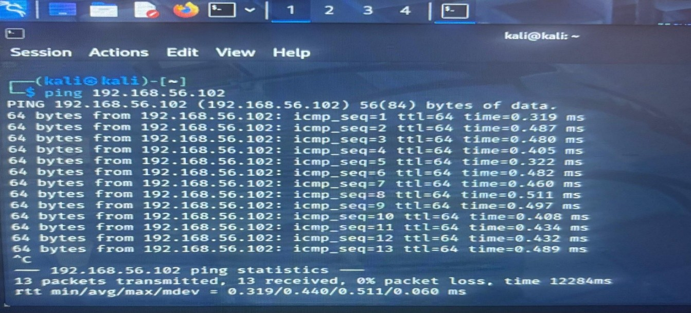

---

## Phase 1: Network Scanning and Service Enumeration

An initial reconnaissance scan was conducted using Nmap to identify open ports, services, and software versions. The scan utilised SYN scanning (`-sS`) and service version detection (`-sV`).

The purpose of this phase was to map the target system’s exposed attack surface by identifying accessible network services and their configurations. This provides a foundational understanding of the system and informs subsequent vulnerability analysis. The results identified ports 139 (NetBIOS) and 445 (SMB) as open, confirming that SMB services were active and reachable on the network.

This phase is critical in establishing whether further SMB-focused testing is justified, as it verifies both the presence and accessibility of the target service.

#### Figure 2: Nmap scan results
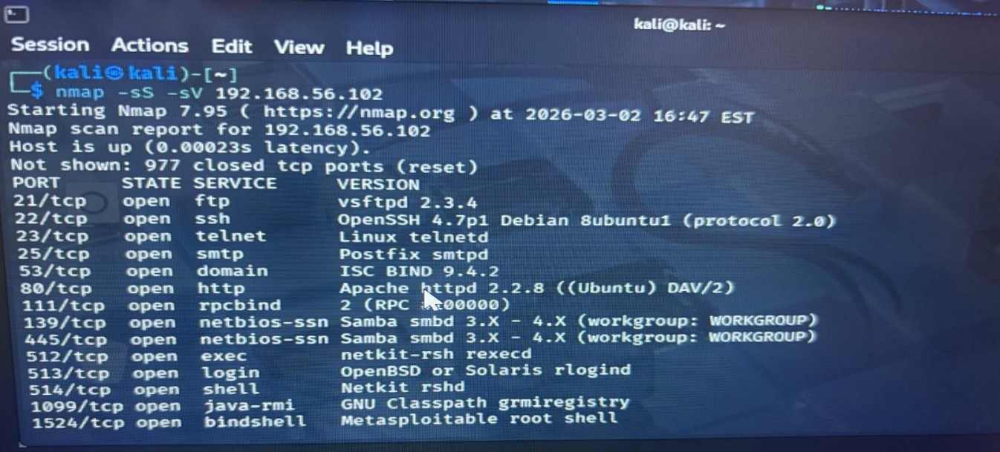
---

## Phase 2: SMB Protocol Analysis and Vulnerability Identification

The SMB service was analysed to determine whether it was outdated or insecure. Service version detection indicated that the system was running an obsolete Samba implementation.

The purpose of this phase was to evaluate the security posture of the identified service, moving beyond simple detection to assess potential risk. By identifying the use of a legacy Samba version, it becomes possible to determine whether the service is likely to contain known weaknesses or rely on deprecated protocols.

The presence of SMB on ports 139 and 445, combined with legacy versioning, suggests an increased attack surface. While vulnerabilities such as CVE-2017-0144 apply specifically to Windows SMB implementations, they highlight the broader risks associated with outdated SMB protocols and reinforce the importance of assessing legacy services.

#### Figure 3: SMB service identification
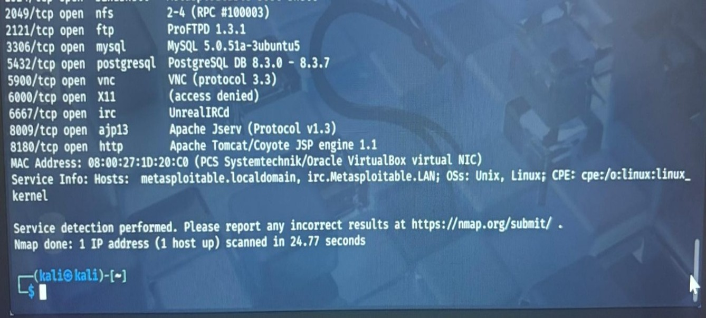

#### Figure 9: Samba Version Identification
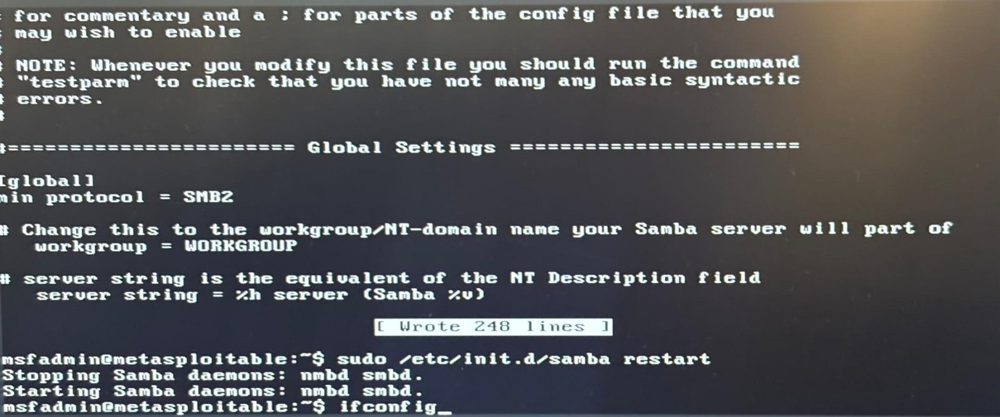
---

## Phase 3: SMB Enumeration

Enumeration was performed using `enum4linux` to assess the level of information disclosure without authentication.

The purpose of this phase was to determine how much sensitive information could be obtained by an unauthorised user. The scan revealed:

* System hostname
* Shared folders
* User account information
* Password policy details
* Operating system information

This level of exposure represents a significant security concern, as it provides attackers with valuable intelligence that can be used to support further attacks. Information gathered during enumeration can facilitate credential-based attacks, targeted exploitation, and lateral movement within a network.

#### Figure 4: SMB enumeration output
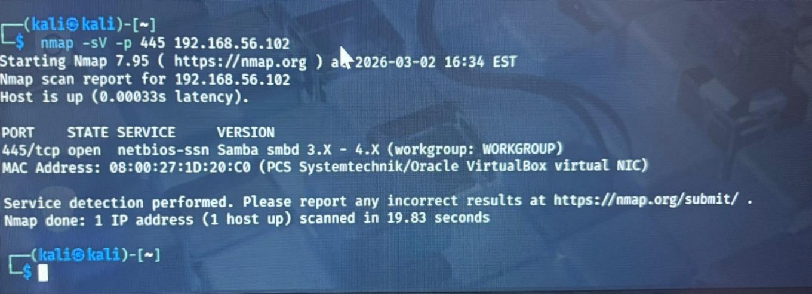
#### Figure 5: Additional enumeration results
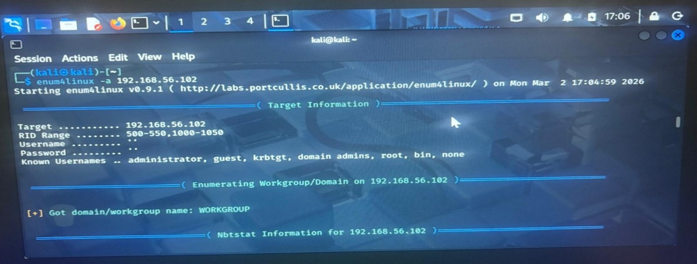
---

## Phase 4: Manual SMB Access Verification

Manual verification was conducted using `smbclient` to confirm SMB protocol behaviour:

```bash
smbclient -L //192.168.56.102/ -N

```

The purpose of this phase was to validate the results obtained from automated tools and confirm the behaviour of the SMB service through direct interaction. The system accepted an anonymous connection and returned a list of shared resources, including administrative shares.

The connection process indicated fallback to SMBv1, confirming that the system actively negotiates the deprecated protocol. This manual validation is important because it provides direct evidence of insecure protocol usage and ensures that automated findings are accurate and reliable.

#### Figure 6: SMBClient Anonymous Login
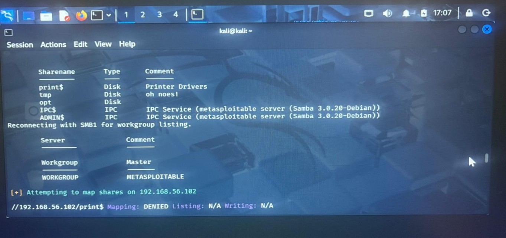
#### Figure 7: SMB Protocol Negotiation
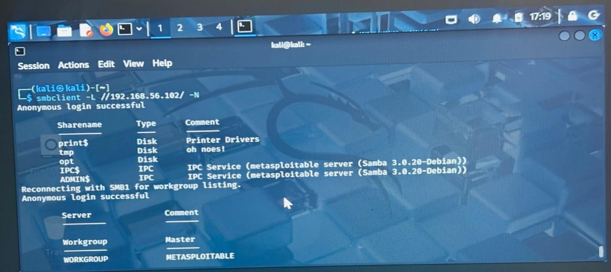
#### Figure 8: SMBClient Tree Connect
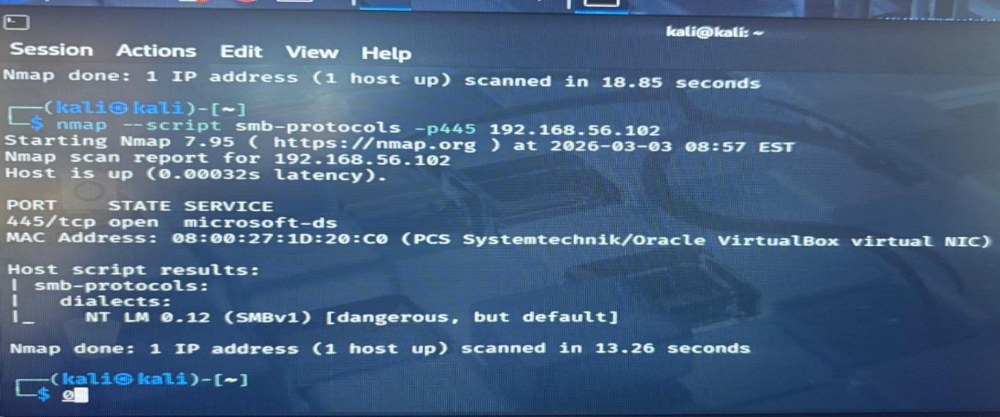
---

## Phase 5: SMBv1 Remediation and Validation

### Pre-Remediation Assessment

An Nmap script scan was used to confirm SMB protocol support:

```bash
nmap --script smb-protocols -p445 <target IP>

```

**Result:** NT LM 0.12 (SMBv1) — insecure and deprecated

A secondary scan was conducted:

```bash
nmap -p445 --script smb-vuln* <target IP>

```

The purpose of this step was to establish a baseline security state before any remediation was attempted. This ensures that the presence of SMBv1 is clearly evidenced and allows for direct comparison after configuration changes are applied.

#### Figure 7 (Alt): SMBv1 detection results


> *Note: Referred to as Figure 7 in text chronology.*

---

### Configuration Change

The Samba configuration file (`/etc/samba/smb.conf`) was modified to include:

```ini
min protocol = SMB2

```

The configuration was validated using `testparm`, and the Samba service was restarted:

```bash
sudo /etc/init.d/samba restart

```

The purpose of this phase was to attempt remediation by disabling the insecure SMBv1 protocol and enforcing the use of a more secure alternative. This reflects a common defensive approach in real-world environments, where insecure protocols are mitigated through configuration changes.

#### Figure 10: SMB Conf Before Changes
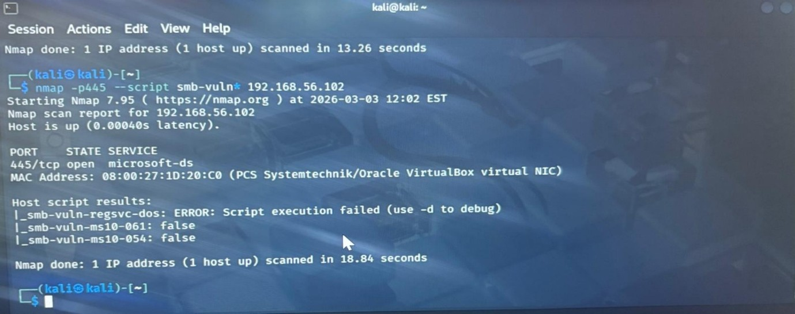

#### Figure 11: SMB Conf After Changes

---

### Post-Remediation Validation

A follow-up scan was conducted:

```bash
nmap --script smb-protocols -p445 <target IP>

```

The results showed that SMBv1 remained enabled. The purpose of this phase was to verify whether the remediation was successful by comparing pre- and post-change results.

This confirms that Samba 3.0.20 does not support SMB2 or SMB3, meaning the configuration change was ineffective. This highlights an important security principle: vulnerabilities cannot always be resolved through configuration alone when the underlying software lacks support for secure alternatives.

#### Figure 13: SMB Protocol Validation After Fix
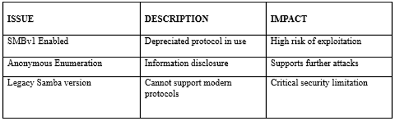

---

## Findings

### Phase 1: Network Scanning and Service Enumeration

The scan identified ports 139 (NetBIOS) and 445 (SMB) as open on the target system, confirming that the Server Message Block (SMB) service was accessible over the network. No exploitation was conducted during this phase, as the objective was limited to reconnaissance and attack surface identification. This phase established a baseline understanding of exposed services and confirmed that the system could be targeted for further SMB-specific analysis.

### Phase 2: SMB Protocol Analysis and Vulnerability Identification

Service version enumeration revealed that the target system was running an outdated Samba implementation. Legacy versions of Samba are known to lack support for modern security protocols and may contain unpatched vulnerabilities. While specific exploits such as CVE-2007-2447 apply directly to legacy Samba systems, their existence highlights the broader risks associated with legacy SMB protocols. The presence of outdated SMB software therefore represents a significant security concern and a potential attack vector.

### Phase 3: SMB Enumeration

The enumeration process, conducted using `enum4linux`, revealed extensive information accessible without authentication. This included the system hostname, shared resources, user account details, password policies, and operating system information. This level of unauthorised information disclosure significantly increases the risk of further exploitation. Such data provides potential attackers with actionable intelligence that could be used to support credential-based attacks, privilege escalation attempts, or lateral movement within a network.

### Phase 4: Manual SMB Access Verification

Manual testing confirmed that the SMB service permitted anonymous access and returned a list of shared resources, including administrative and temporary shares. The connection process indicated that the client negotiated SMBv1, confirming that the system actively supports the deprecated protocol. This provides direct evidence of insecure configuration and reinforces the findings from automated scans.

### Phase 5: SMBv1 Remediation and Validation

The initial assessment confirmed that the system supported SMBv1 (NT LM 0.12), which is considered insecure and deprecated. Following modification of the Samba configuration and service restart, a subsequent scan showed that SMBv1 remained enabled.

This indicates that the installed Samba version (3.0.20) does not support SMB2 or SMB3 and therefore cannot enforce the configured protocol restriction. This demonstrates a critical limitation: vulnerabilities cannot always be mitigated through configuration alone when the underlying software lacks support for secure alternatives. A final vulnerability scan did not identify SMB-specific exploits, which is expected as many automated scripts are designed to target Windows SMB implementations rather than legacy Samba systems.

---

### Table 1: Critical Findings Table

| Phase | Vulnerability / Finding | Risk Level | Evidence Reference | Mitigation Summary |
| --- | --- | --- | --- | --- |
| **Phase 1** | Open Ports 139 & 445 Enabled | Information Only | Figure 2 | Keep ports closed unless strictly required; baseline discovery. |
| **Phase 2** | Outdated Samba implementation (v3.0.20) | High | Figure 3, Figure 9 | Upgrade underlying host server / Samba software engine. |
| **Phase 3** | Unauthenticated Information Disclosure | Medium | Figure 4, Figure 5 | Limit Null Session and anonymous share enumerations. |
| **Phase 4** | Null Session / Anonymous Share Access | High | Figure 6, Figure 8 | Disable anonymous access to shared system vectors. |
| **Phase 5** | Unenforceable SMBv1 Decommissioning | **High to Critical** | Figure 10, 11, 13 | Host platform replacement; Software upgrade to newer engine. |

### CVSS Scoring

The highest risk arises from the inability to disable SMBv1 due to the obsolete Samba version, significantly increasing exposure to remote attacks.

#### Figure 12: CVSS Scoring Table
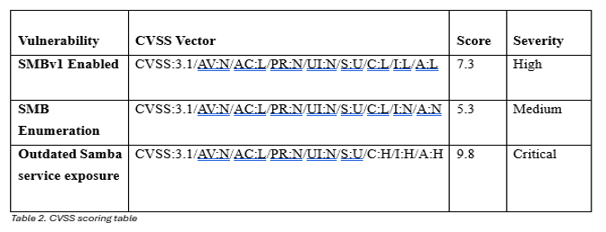
---

## Conclusion

The assessment confirmed that the Metasploitable 2 host is critically exposed due to its reliance on the obsolete SMBv1 protocol. Despite successful configuration changes and service restarts, the system continued to negotiate SMBv1 because Samba 3.0.20 does not support SMB2 or SMB3. This demonstrates that some vulnerabilities cannot be remediated through configuration alone when the underlying software lacks the necessary capabilities.

The impact of this vulnerability is significant, increasing the risk of remote exploitation, credential interception, and lateral movement within a network. The likelihood of exploitation is high due to the widespread availability of tools targeting legacy SMB services. As a result, the overall risk is assessed as high to critical, particularly when considering the system’s inability to adopt more secure protocols.

This assessment reinforces the importance of understanding the limitations of legacy software and the need for strategic remediation. In this case, the only effective long-term solution is to upgrade or replace the system. This ensures alignment with modern security best practices and significantly reduces exposure to high-risk vulnerabilities.


